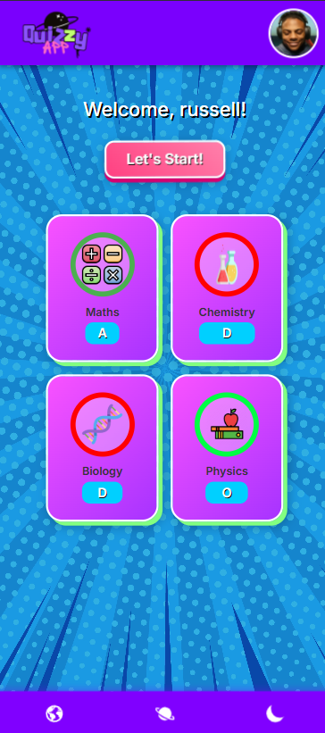
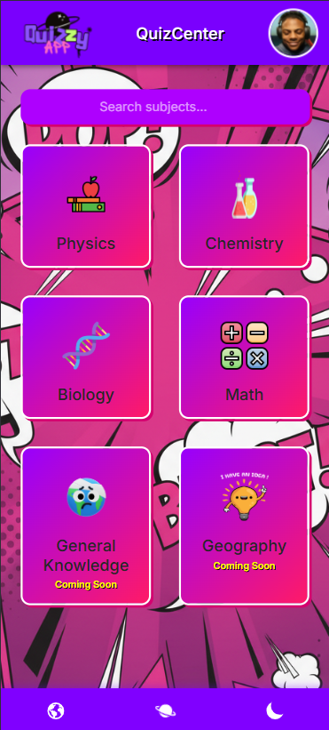

# 📚 Quiz App (Angular + Ionic)

A simple, interactive, and mobile-friendly **Quiz Application** built using **Angular** and **Ionic Framework**.  
The app supports multiple-choice questions, shows progress, and displays the final score with a clean, modern UI.

---

## 🚀 Features

- ✔️ Built using **Angular** + **Ionic**
- ✔️ Responsive UI for all screen sizes
- ✔️ Multiple-choice quiz functionality
- ✔️ Real-time score calculation
- ✔️ Smooth navigation and transitions
- ✔️ Lightweight and fast performance
- ✔️ **APK file included** (located in the `APK/` folder at the root)

---

## 📸 Screenshots


### 🏠 Home Screen


### 🏠 Subjects Screen


### 📝 Level Screen


### 🏁 Question Screen


---

## 🛠️ Tech Stack

- **Angular**
- **Ionic Framework**
- **TypeScript**
- **HTML5 / SCSS**

---

## 📦 Installation & Setup

```bash
# Clone the repository
git clone <your-repo-link>

# Navigate into the project
cd quiz-app

# Install dependencies
npm install

# Run the app
ionic serve
